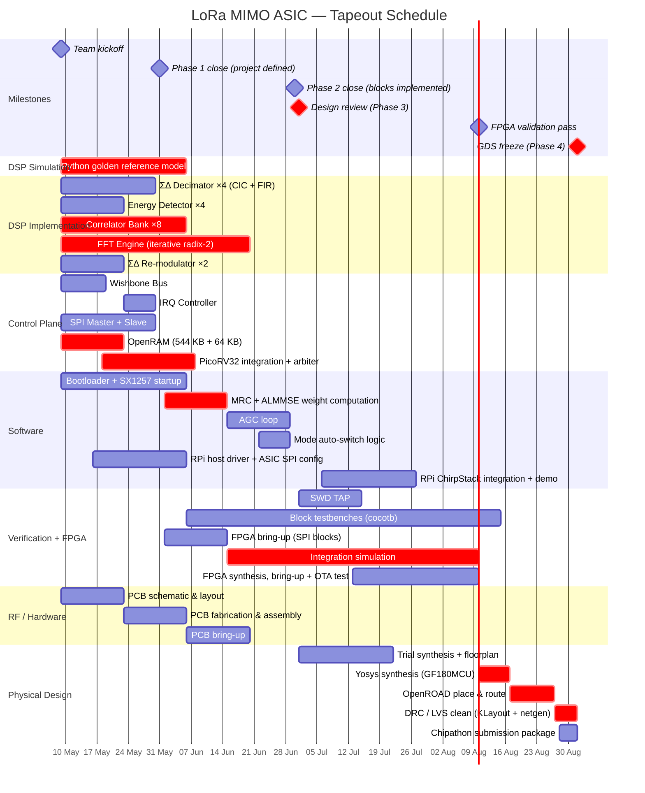

# Project Schedule

Tapeout deadline: **1 September 2026**. Design review: **July 2026**. Today: **6 May 2026**.

See [Chipathon 2026](Chipathon%202026.md) for official phase definitions.

---

---

## Critical path

The chain that determines whether September 1 is achievable:

1. **FFT Engine RTL** (May 9 → Jun 20) — most complex DSP block; iterative radix-2 with SRAM interface across 4 antennas
2. **Correlator Bank RTL** (May 9 → Jun 6) — 8 coherent integrators; determines H matrix quality
3. **Baseband SRAM OpenRAM** (May 9 → May 23) — must run OpenRAM compiler week 1; everything else depends on SRAM working
4. **PicoRV32 integration** (May 18 → Jun 8) — needs SRAM and bus; firmware can't be tested until this is done
5. **ALMMSE firmware** (Jun 8 → Jun 22) — 2×2 matrix inversion in RV32IM; must be done before integration sim
6. **Integration simulation** (Jul 1 → Jul 22) — first time all blocks connect; expect ~1 week debug margin
7. **FPGA OTA test** (Aug 3 → Aug 10) — Arty A7 validates NT=1 + NT=2 before GDS
8. **OpenROAD P&R → DRC/LVS** (Aug 17 → Sep 1) — 2.5 weeks; no float

Trial synthesis runs from Jul 1 to catch area/timing surprises while RTL is still in flux. Final P&R begins Aug 17 once RTL is frozen. FPGA OTA test and final P&R overlap deliberately (Aug 10–17) — if FPGA finds an RTL bug after Aug 17, P&R must restart. Keep FPGA test scope to packet RX, MIMO combining, IRQ rather than exhaustive corner cases.

---

## Float / risk

| Risk | Float | Mitigation |
| --- | --- | --- |
| FFT engine runs late | 1 week | Start cocotb testbench in parallel with RTL |
| OpenRAM generation fails | 0 days (critical path) | Run OpenRAM compiler week 1; use behavioural SRAM model for simulation if needed |
| Correlator bank coherence issues | 3 days | Validate with Python golden model before RTL; test each correlator independently |
| ALMMSE firmware overflow (fixed-point) | 3 days | Validate Q1.15 scaling in Python before porting to C |
| Phase coherence across SX1257s 2–4 | TBD | RF/analog team to verify CLK distribution before FPGA bring-up |
| DRC violations in P&R | 3 days | GF180MCU standard cells only; let OpenROAD handle fill |
| Chipathon shuttle deadline shifts | — | Monitor SSCS announcements; July design review gives early warning |
