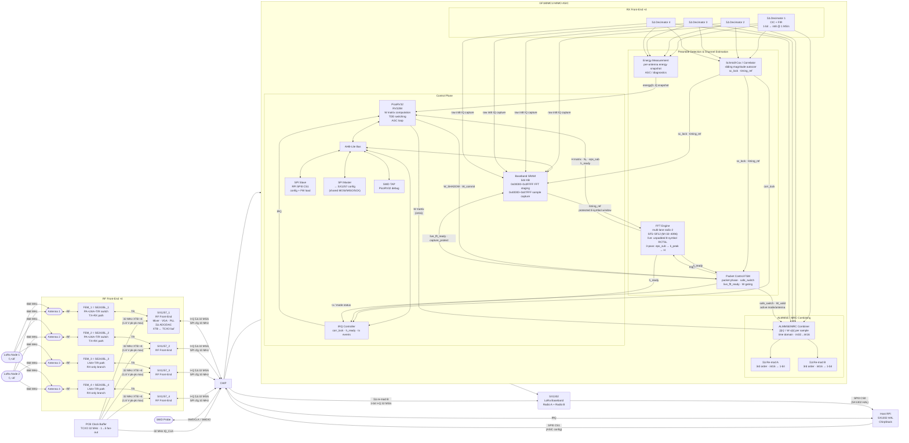

# System Architecture & Block Overview

> Architecture B — NT=1 NR=4 MRC / NT=2 NR=4 ALMMSE multi-mode MIMO gateway ASIC.
> GF180MCU. SSCS PICO Chipathon 2026. Tapeout deadline: September 2026.

---

## System Architecture



Notes:

- `FEM` = front-end module. Here it means the external `SE2435L` RF front-end on each antenna branch.
- `Energy Measurement` is shown explicitly because it shares the preamble-detection path but also provides the per-antenna snapshot used by AGC and diagnostics.

---

## Interfaces

| Interface | From | To | Signal | Rate |
| --- | --- | --- | --- | --- |
| RX I/Q ×4 | SX1257_1–4 ΣΔ ADC | ASIC decimators | 1-bit I+Q sigma-delta | 32 MS/s per antenna |
| RX CLK | PCB Clock Buffer | ASIC (shared) | 32 MHz clock | — |
| SPI config | ASIC SPI master | SX1257_1–4 | RegMode, freq, gain | 10 MHz |
| ΣΔ re-mod A | ASIC | SX1302 Radio A | 1-bit I+Q sigma-delta | 32 MS/s |
| ΣΔ re-mod B | ASIC | SX1302 Radio B | 1-bit I+Q sigma-delta | 32 MS/s |
| Host SPI | RPi SPI0 CS1 | ASIC SPI slave | Config registers + FW load | 10 MHz |
| SX1302 SPI | RPi SPI0 CS0 | SX1302 | SX1302 HAL (packets, config) | 10 MHz |
| IRQ | ASIC | RPi GPIO | Packet ready, error | GPIO |
| SWD | SWD probe | ASIC SWD TAP | SWDCLK + SWDIO | — |

### SX1257 → ASIC (RX, per antenna)

| Signal | Direction | Description |
| --- | --- | --- |
| `IQ_DATA_I[n]` | SX1257_n → ASIC | 1-bit RX I sigma-delta stream |
| `IQ_DATA_Q[n]` | SX1257_n → ASIC | 1-bit RX Q sigma-delta stream |
| `IQ_CLK` | PCB Buffer → ASIC | 32 MHz shared clock from central TCXO buffer |

### ASIC → SX1302 (ΣΔ re-mod output)

| Signal | Direction | Description |
| --- | --- | --- |
| `REMOD_A_I` / `REMOD_A_Q` | ASIC → SX1302 Radio A | Stream 1 — NT=1 combined / NT=2 node 1 |
| `REMOD_B_I` / `REMOD_B_Q` | ASIC → SX1302 Radio B | Stream 2 — NT=2 node 2 (unused in NT=1) |
| `REMOD_CLK` | ASIC → SX1302 | 32 MHz clock for SX1302 data sync (CLK_OUT mode per SX1257 §3.5.2) |

SX1302 IF channel config for NT=2: `if_cfg[0].freq_hz = +Δf`, `if_cfg[1].freq_hz = -Δf`.

> **Clock source:** `REMOD_CLK` is derived from the existing `IQ_CLK` input (central TCXO buffer). No additional PLL required — ASIC fans the received 32 MHz out to SX1302. Uses the 1 spare pad; **0 spare pads remain**.

### ASIC ↔ SX1257 (shared SPI config bus)

| Signal | Description |
| --- | --- |
| `SPI_MOSI` | Shared — ASIC master drives when SX1257_CSn asserted; ASIC slave drives when HOST_CS asserted |
| `SPI_MISO` | Shared — ASIC tristates when acting as SPI master |
| `SPI_SCK` | Bidirectional — host drives during host→ASIC; ASIC drives during ASIC→SX1257 |
| `SX1257_CS[3:0]` | ASIC → SX1257_1–4 chip selects |
| `HOST_CS` | RPi SPI0 CS1 → ASIC chip select |

### SX1257 board-level pin dispositions (not ASIC pads)

The following SX1257 pins require a PCB-level decision; none connect to ASIC pads.

| SX1257 pin | All 4 devices | Notes |
| --- | --- | --- |
| RESET (pin 9) | Leave floating during POR; connect to RPi GPIO for optional manual reset | Must float during POR sequence (§6.2.1). Pull to GND via 100 nF cap to filter transients. If RPi GPIO used: drive high >100 µs, release, wait 5 ms before SPI access. **Decision needed: floating-only or RPi-controlled?** |
| XTA (pin 6) | All 4 devices: leave open (float) | When using XTB as TCXO/external clock input (§3.3.1), XTA must be left open. |
| XTB (pin 8) | All 4 devices: receive 32 MHz from central clock buffer via 100 pF AC-cap | **CRITICAL ELECTRICAL LIMIT:** Max amplitude **1.8 V pk-pk** (§3.3.1). If central buffer is 3.3V, a voltage divider or 1.8V buffer is mandatory. This pin is the reference for both RX and TX PLLs, ensuring system-wide frequency alignment. |
| CLK_IN (pin 11) | All 4 devices: leave NC | **Design Decision:** Using internal clock mode (§3.5.2) to save ASIC pads. Frequency lock is maintained via shared XTB reference. |
| CLK_OUT (pin 10) | All 4 devices: leave NC | CLK_OUT is unused in the buffered clock architecture. Central buffer drives ASIC `IQ_CLK` directly. |

---

## Pin Verification & Electrical Constraints

A surgical review of the SX1257 datasheet (v1.2) was performed on May 4, 2026. The following constraints are binding for PCB layout and system integration:

### 1. Clocking & Synchronization
- **XTB (Pin 8) Voltage Limit:** Absolute maximum of 1.8V pk-pk. Exceeding this may damage the internal oscillator circuitry or degrade phase noise.
- **XTA (Pin 6) Floating:** Must be left open when driving XTB with an external clock (§3.3.1). Do not ground.
- **TX Synchronization:** Pin 11 (CLK_IN) is bypassed. Data at `I_IN/Q_IN` is sampled by the internal clock derived from XTB. Since the ASIC and SX1257 share the same TCXO reference, they are frequency-locked.

### 2. Power & Decoupling
- **Internal LDOs:** Pins 1 (VR_PA), 3 (VR_ANA1), 5 (VR_DIG), and 25 (VR_ANA2) are outputs of internal regulators. 
- **Mandatory Decoupling:** Each requires a 10µF tantalum/ceramic in parallel with a 100nF ceramic capacitor strictly as shown in Fig 6-4. 
- **No External Loading:** These pins must not power any external circuitry.

### 3. Thermal & Grounding
- **Exposed Pad (Pin 0):** This is the primary ground and thermal path. It must be soldered to a large ground plane with multiple thermal vias to handle the TX PA return current.

### 4. Digital Interface
- **Reset (Pin 9):** Active high. Must be floating or high-impedance during the power-on-reset (POR) cycle to allow internal pull-up logic to function (§6.2.1).
- **SPI Logic Levels:** 3.3V CMOS compatible (up to VDD). Max frequency 10 MHz.
| I_IN / Q_IN (pins 13/12) | SX1257_1/2: driven by SX1302 TX I/Q bitstream. SX1257_3/4: tie to GND (10 kΩ pull-down) | SX1257_3/4 are RX-only; TX inputs must be held at a defined level. TxEnable=0 in firmware suppresses any DAC output regardless, but tie low to be safe. |
| DIO0–DIO3 (pins 21–24) | Leave NC | ASIC has 0 spare pads. PLL lock is polled via `RegModeStatus` (0x11) over SPI instead. |
| VBAT1/VBAT2/VBAT3 (pins 2/16/32) | Supply input — bulk decoupling per application schematic (Fig 6-4) | Main supply pins. Each needs 10 µF bulk + 100 nF to GND. VBAT3 feeds the TX PA amplifier — higher current draw during TX (~380 mA per SE2435L); ensure adequate copper pour and via stitching. |
| VR_PA/VR_ANA1/VR_DIG/VR_ANA2 (pins 1/3/5/25) | Internal LDO outputs — decoupling caps to GND per Fig 6-4 | Each needs 100 nF + 10 µF to GND. Do not load these pins externally. |

> **I_OUT/Q_OUT pin name note (SX1257 Table 1-1 apparent typo).** Table 1-1 describes pin 14 Q_OUT as "I (inphase) channel ADC output" and pin 15 I_OUT as "Q (quadrature) channel ADC output" — contradicting the §3.7.1 block diagram which correctly shows I_OUT ← I-channel ADC and Q_OUT ← Q-channel ADC. The pin names (I = in-phase, Q = quadrature) and the block diagram are self-consistent; the Table 1-1 descriptions are a Semtech typo. Connect I_OUT → `IQ_DATA_I[n]` and Q_OUT → `IQ_DATA_Q[n]` as shown in the pad list.

### RPi → ASIC (host config + firmware load)

| Signal | Direction | Description |
| --- | --- | --- |
| `HOST_CS` | RPi → ASIC | SPI0 CS1 — active low |
| `SPI_SCK` | RPi → ASIC | Shared SPI clock |
| `SPI_MOSI` | RPi → ASIC | Config writes + firmware binary |
| `SPI_MISO` | ASIC → RPi | Status register readback |
| `IRQ` | ASIC → RPi | Interrupt: packet ready, preamble lock |

### Boot sequence (firmware load)

```
RPi: assert cpu_reset=1 (SPI register write to ASIC)
RPi: write firmware.bin to IMEM base address (0x0000) over SPI
RPi: de-assert cpu_reset=0
PicoRV32: fetch from 0x00000, begin execution
```

### TX signal chain

```
Host RPi → lgw_send() → SX1302 CSS Modulator → SX1257_1/2 TX DAC → Antenna 1/2
```

The ASIC is not in the TX data path. Its role is TDD switching and RX protection:

1. RPi writes `TX_CTRL[0]=1` (`TX_PREP`)
2. PicoRV32 IRQ: clears `ANTENNA_EN[0:1]` → combiner drops ant 0,1 immediately
3. PicoRV32: writes `RegMode=0x0D` to SX1257_1 and SX1257_2 via SPI master (~6 µs SPI + 120 µs TS_TR)
4. PicoRV32: sets `TX_ACTIVE=1`; RPi polls or waits fixed delay
5. RPi: calls `lgw_send()` → SX1302 transmits via SX1257_1/2
6. RPi: writes `TX_CTRL[1]=1` (`TX_DONE`) after `lgw_send()` returns
7. PicoRV32 IRQ: writes `RegMode=0x03` to SX1257_1/2; waits TS_RE (~150 µs)
8. PicoRV32: restores `ANTENNA_EN[0:1]`; clears `TX_ACTIVE`; invalidates W
9. System returns to 4-antenna RX; W recomputed on next sc_lock

LoRaWAN RX1 budget = 1,000,000 µs; total switching overhead ~280 µs — margin >3,500×.

> **REMOD output during TX window.** During steps 5–6, the combiner continues running on antennas 3+4 and REMOD_A is still driven to SX1302 Radio A — which is simultaneously transmitting. The SX1302 datasheet does not explicitly state whether the digital input is ignored during TX; this must be verified against the SX1302 HAL and register map before tapeout. If the SX1302 does not cleanly ignore REMOD_A during TX, the ASIC will need to gate REMOD_A (force to midscale or zero) for the duration of the TX window. No RTL provision for this exists yet — add a `remod_gate` signal driven by `TX_ACTIVE` if required.

> **RF isolation — TX leakage into active RX antennas.** Each antenna uses a Skyworks SE2435L FEM (PA+LNA+T/R switch). SE2435L_3/4 (RX-only) have their SX1257s put to standby in step 2, which de-asserts RX_EN and switches the SE2435L LNA to bypass mode (IP1dB = +10 dBm vs −12 dBm active). At +27 dBm TX with 40 dB board isolation, leakage is −13 dBm — 23 dB below the bypass compression point. **Action for RF/analog team:** characterise actual board isolation at 868 MHz. If isolation < 37 dB (+10 dBm at bypass input), additional measures (limiter diode, or full SE2435L sleep) are required. If isolation > 50 dB, the standby step can be removed. See [SE2435L Front-End Module](blocks/SE2435L%20Front-End%20Module.md).

---


## Fidelity and Stability Concerns

The RX signal path relies on precise scaling and saturation logic to maintain signal integrity from the antenna to the radio output. The following constraints are binding for design and verification:

| Pressure Point | Stage | Risk | Mitigation/Verification Requirement |
| --- | --- | --- | --- |
| **Decimator Droop** | Stage 2 | Band-edge roll-off | FIR coefficients must be tuned to `DECIM_CFG`; verify cumulative frequency response is flat ±0.5 dB. |
| **Combiner Truncation** | Stage 6 | Signal clipping or quantization noise | Firmware scaling of `W` matrix must maximize `int16` headroom without hitting saturating thresholds. |
| **Re-modulator Stability** | Stage 7 | Integrator latch-up / Instability | Input must be strictly `< -3 dBFS`. Saturating adders are mandatory; wrap-around will cause permanent instability. |

> **End-to-End Verification Requirement:** A 'bit-exactness' check is required. The RTL implementation must be validated against a high-precision Python reference model using test vectors across the full input dynamic range to ensure error-signal SNR reflects only LSB quantization and no correlated clipping artifacts.

| Group | Pads | Notes |
| --- | --- | --- |
| SX1257 DATA_I ×4 | 4 | |
| SX1257 DATA_Q ×4 | 4 | |
| SX1257 CLK (shared) | 1 | Central TCXO buffer → ASIC IQ_CLK pad |
| SX1302 Radio A I+Q | 2 | ΣΔ re-mod stream 1 |
| SX1302 Radio B I+Q | 2 | ΣΔ re-mod stream 2 |
| SX1302 CLK_OUT | 1 | 32 MHz clock to SX1302 (fan-out of IQ_CLK) |
| SPI MOSI / MISO / SCK | 3 | Shared host↔ASIC and ASIC↔SX1257 |
| SX1257 CS ×4 + Host CS | 5 | ASIC is RPi SPI0 CS1; SX1302 uses SPI0 CS0 |
| Core CLK + RESET | 2 | |
| SWD (SWDCLK + SWDIO) | 2 | |
| VDD IO 3.3V | 1 | |
| VDD core 1.8V | 2 | Two pads for IR drop distribution |
| GND | 4 | |
| Spare | 0 | Used by SX1302 CLK_OUT |
| **Total** | **33** | At ≤33 per-team allocation limit |

---

## Clock domain crossing boundaries

The design has a single internal clock domain (32 MHz, sourced from the central PCB TCXO buffer — the same reference driven to all four SX1257 XTB pins). All DSP blocks, PicoRV32, AHB-Lite bus, and SPI master are synchronous to this domain.

> **CFO is a transmitter-only property.** Because all four SX1257 AFEs and the ASIC itself derive their clocks from one TCXO, there is no sampling-rate offset (SRO) between antennas or between the ADC outputs and ASIC processing. Any observed carrier frequency offset `df` is entirely due to the remote transmitter's TCXO offset. The digital CFO correction `exp(−j2π·df_est·n/Fs)` applied in firmware operates with cycle-accurate sample indexing — no accumulated phase error from clock-domain mismatch. The residuals quantified in `sim/notebooks/02_cfo_estimation.ipynb` are therefore the complete error budget.

The following boundaries require explicit CDC treatment:

| Boundary | Async signal(s) | Direction | Required treatment | Documented in |
| --- | --- | --- | --- | --- |
| RPi SPI slave | `HOST_CS`, `SPI_SCK`, `SPI_MOSI` | RPi → ASIC | 2-FF synchroniser on `HOST_CS` and `SPI_SCK` edges; or run SPI slave FSM in the SPI clock domain with AHB-Lite handshake | [SPI Slave](blocks/SPI%20Slave.md) |
| SWD TAP | `SWDCLK`, `SWDIO` | Probe → ASIC | 2-FF synchroniser on `SWDCLK` into 32 MHz domain; or implement TAP entirely in `SWDCLK` domain with handshake | [SWD TAP](blocks/SWD%20TAP.md) |
| SX1257 DIO inputs | `DIO0`–`DIO3` from each SX1257 | SX1257 → ASIC | 2-FF synchroniser per pin; see note below | [SPI Master](blocks/SPI%20Master.md) |

**SX1257 I/Q bitstreams are NOT a CDC boundary.** All four SX1257s receive the 32 MHz reference on their **XTB** pins (sourced from a shared TCXO via a clock buffer), so their `I_OUT`/`Q_OUT` signals change on the falling edge of the same clock the ASIC uses. This is a timing-constraint problem (board-level setup/hold on pad inputs), not a metastability problem. **Note: Using CLK_IN (pin 11) is incorrect as it only feeds the TX DAC.**

**SX1257 DIO pins.** The DIO outputs (`pll_lock_rx`, `pll_lock_tx` per Table 4-1 of SX1257 datasheet) are driven by SX1257 internal logic with no guaranteed phase relationship to the ASIC's sampling edge. They are only used during initialisation (PLL lock polling) and are not in the packet-data path. A 2-FF synchroniser on each connected DIO input is sufficient.

> In practice, PLL lock can alternatively be checked by reading `RegModeStatus` (0x11) over SPI rather than routing DIO pins to pads. If the DIO pads are not bonded out, no synchroniser is needed — firmware polls via SPI instead. Decide at pad allocation time.

---

## Gate count & area summary

| Component | GE | Area (est.) |
| --- | --- | --- |
| ΣΔ Decimator ×4 (CIC + FIR) | ~12,000 | |
| Schmidl-Cox Detector (ring buf + autocorr + CORDIC) | ~4,000 | |
| FFT Engine (iterative, SF5–SF12) | ~10,000 | |
| ALMMSE/MRC Combiner | ~10,000 | |
| ΣΔ Re-mod ×2 | ~1,400 | |
| PicoRV32 RV32IM | ~10,000 | |
| SPI Slave + SPI Master + AHB-Lite | ~5,000 | |
| Status register bank | ~1,000 | |
| IRQ + misc | ~800 | |
| **Logic total** | **~54,200 GE** | **~0.66 mm²** |
| Baseband SRAM (544 KB) | — | ~4.50 mm² |
| PicoRV32 IMEM+DMEM (64 KB) | — | ~0.52 mm² |
| **Total** | | **~5.68 mm²** |

> SRAM area is the critical constraint. Run GF180MCU OpenRAM compiler for 544 KB and 64 KB macros before committing to final floorplan. If a single 544 KB macro is impractical, split Baseband SRAM into 256 KB FFT staging and 288 KB capture macros.

---

## Operating modes

| Mode | Config | Combining | Output | Notes |
| --- | --- | --- | --- | --- |
| 1 | NT=1, NR=4 | MRC | ΣΔ re-mod → SX1302 Radio A | Backward compatible, default |
| 2 | NT=2, NR=4 | ALMMSE | ΣΔ re-mod ×2 → SX1302 Radio A+B | Extension mode; spatial separation is primary, small `Δf` may assist identification / estimation |
| 3 | NT=1, NR=1 | Passthrough (bypass) | ΣΔ re-mod → SX1302 Radio A; Radio B idle | Stages 3–7 bypassed; single-antenna baseline for SNR/BER comparison |

Mode auto-switches per frame (auto mode only); returns to Mode 1 on frame end. If `Δf` assist is used for NT=2, SX1302 IF channels must be configured accordingly. Mode 3 (passthrough) is selected by writing `MIMO_CTRL.MODE = 2`; antenna is chosen by the lowest set bit of `ANTENNA_EN`.

> **NT=2 node coordination requirement.** `NT=2` remains an extension path. The current direction is simultaneous payload transmission with separation driven mainly by spatial processing; a small `Δf` may be used only as an identification or channel-estimation aid. Large symmetric offsets are no longer the preferred assumption because they risk bandwidth occupancy and compatibility problems. Standard LoRaWAN Class A nodes still will not intentionally overlap in the required way, so any real `NT=2` deployment requires custom node firmware or a network scheduler. This remains a private MIMO testbed extension, not a drop-in LoRaWAN upgrade. `NT=1` MRC mode operates normally with any standard LoRaWAN node and is unaffected.

---

## Block ownership

See [Work Allocation Summary](Work%20Allocation.md) for a more detailed assignment view with subblocks and responsibilities.

| Block | Owner | Spec |
| --- | --- | --- |
| ΣΔ Decimator ×4 (CIC + FIR) | TBD | — |
| Schmidl-Cox Preamble Detector | TBD | — |
| FFT Engine (iterative radix-2, SF5–SF12) | TBD | — |
| ALMMSE/MRC Combiner | TBD | — |
| ΣΔ Re-mod ×2 | TBD | — |
| PicoRV32 RV32IM integration | TBD | — |
| Baseband SRAM (544 KB OpenRAM) | TBD | — |
| PicoRV32 SRAM (16 KB OpenRAM) | TBD | — |
| SPI Slave (host interface) | TBD | — |
| SPI Master (→ SX1257) | TBD | — |
| AHB-Lite Bus | TBD | — |
| Status Register Bank | TBD | [Register Map](Register%20Map.md) |
| IRQ Controller | TBD | — |
| SWD TAP | TBD | — |
| PicoRV32 firmware + algorithms | TBD | [MIMO Algorithms](MIMO%20Algorithms.md) |
| Physical design & floorplan | TBD | — |
| Verification (cocotb) | TBD | — |
| System simulation and algorithm models (Python/GNU Radio) | TBD | — |

Software and verification deliverables:

- `System simulation and algorithm models` owns the Python-first ladder: behavioral model, algorithm selection, threshold tuning, and fallback policy.
- `Verification (cocotb)` owns RTL-to-Python comparison, packet-level regression, register behavior, and block/integration testbenches.
- `PicoRV32 firmware + algorithms` owns the firmware-side control loop, AGC, W computation, and in-the-loop behavior once the RTL model is stable.
