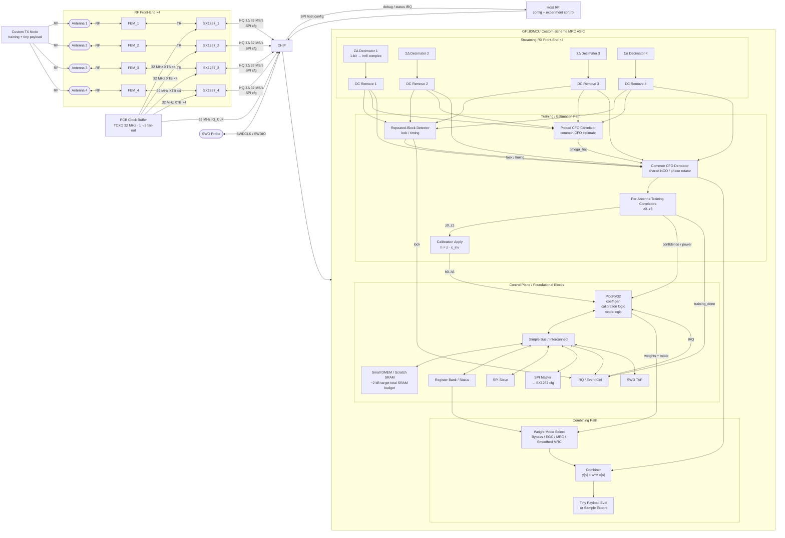

# Custom Scheme MRC Demonstrator

## Goal

Demonstrate coherent receive combining with `NR=4` using the existing `SX1257` front-end while avoiding the RAM-heavy parts of the original LoRa-compatible architecture.

This is a demonstrator plan, not a production LoRaWAN gateway plan.

The objective is to prove:

- per-antenna phase can be estimated at low SNR
- coefficients can be generated on-chip with low memory
- coherent combining gives measurable gain over a single antenna
- the fixed-point combine path works end-to-end with the chosen front-end

## Why a custom scheme

The original LoRa path relies on multi-symbol sample capture and FFT-based preamble processing. That drives SRAM area and control complexity.

The main architectural reason for moving to a custom scheme is the low effective SRAM density available in this process for the sizes needed by the original design direction. In practice, this makes the capture-heavy / FFT-heavy LoRa estimator path unattractive for this project iteration.

Concretely, the custom scheme is being pursued because low RAM density limits:

- packet / preamble sample capture
- large FFT staging buffers
- replay / delayed-payload buffering
- more memory-hungry estimator variants

So the architecture is being deliberately reshaped around:

- streaming processing
- small accumulators
- low-memory coefficient generation
- foundational reusable control blocks such as PicoRV32 and debug access

A custom training-based scheme allows:

- streaming estimation with very small memory
- explicit CFO-friendly packet structure
- very short payloads
- a clean MRC or EGC demonstrator without full LoRa packet compatibility

## Front-end choice

Keep `SX1257 x4` as the RF/digital front-end because it is already integrated into the architecture and has a simple low-pin digital baseband interface.

Assumptions:

- all four receive chains share the same frequency reference as closely as possible
- common CFO dominates branch-to-branch CFO mismatch
- static gain/phase mismatch between branches must still be calibrated

## System diagram

## Demonstrator packet structure

One candidate packet format:

1. repeated training block for timing and common CFO
2. known coefficient-estimation block
3. tiny payload
4. optional checksum / marker

Example intent:

- block A: repeated sequence `A A`
- block B: known sequence `B`
- payload: short symbol burst used only to show post-combining improvement

This separates the tasks:

- block A estimates timing and common CFO
- block B estimates per-antenna complex channel coefficients
- payload is combined using the derived weights

## Custom transmitter baseband

The custom demonstrator also needs a custom transmitter baseband.

Recommended split:

- implement the custom TX baseband on an FPGA
- use the existing RF front-end / radio chain for analog transmission
- keep the ASIC focused on receive-side foundational blocks

This gives the project:

- a flexible way to change packet structure and training format
- a fast path to evaluate different training waveforms
- the ability to inject controlled impairments during experiments
- a cleaner partition between experimental TX PHY work and reusable ASIC RX/control blocks

### Why FPGA is the right TX platform

- fast iteration on packet and training format
- no need to freeze the TX PHY in silicon
- easy to generate repeated training blocks and tiny payloads
- easy to add controlled impairments for verification
- supports bench experimentation without requiring ASIC TX datapath changes

### Suggested FPGA TX blocks

1. packet formatter
2. training sequence generator
3. payload generator
4. optional scrambler / PN generator
5. optional impairment injection
6. modulation block
7. interface to the selected transmit radio path

### Training waveform options on FPGA

The FPGA TX should be able to generate more than one experimental waveform:

- repeated chirp training
- repeated known BPSK/QPSK training
- repeated generic known block for correlation experiments

This makes it possible to compare:

- chirp-based low-SNR acquisition
- simpler PSK-based coefficient estimation
- repeated-block correlation behavior

### Useful impairment injection options

The FPGA is also the right place to inject controlled impairments for testing:

- CFO offset
- phase offset
- timing shift
- amplitude scaling
- payload pattern variation

This is useful for validating:

- common-CFO estimation
- calibration robustness
- weight-generation stability
- MRC vs EGC vs smoothed-MRC behavior

## End-to-end demonstrator split

Recommended system split:

- FPGA TX baseband generates the custom demonstrator waveform
- RF/radio chain transmits the waveform over the air or conducted setup
- ASIC receives through `SX1257 x4`
- ASIC performs streaming estimation, calibration, and combining
- host captures debug/status and compares modes

This keeps the project aligned with both goals:

- reusable foundational RX/control blocks in ASIC
- flexible experimental PHY generation on FPGA

## Receiver block decomposition

### 1. SX1257 interface

- ingest `1-bit I/Q` from four `SX1257` chains

### 2. Decimator x4

- convert bitstreams to low-rate complex samples
- output signed `int8` complex streams

### 3. DC removal

- remove per-branch DC offset before correlation / combining
- keep implementation simple: running mean or packet-pretraining average

Why it is included:

- the `SX1257` is a zero-IF / direct-conversion style front-end, so residual baseband DC offset is a realistic impairment
- DC bias can distort low-SNR repeated-block correlation and training correlation results
- DC bias can inflate branch power estimates and destabilize coefficient generation
- the implementation cost is very small compared with the potential loss in estimator quality

This block is therefore intended as a low-cost protection step for:

- burst detection
- common-CFO estimation
- per-antenna coefficient estimation
- stable combining behavior

### 4. Burst / timing detector

- detect presence of the repeated training block
- can reuse Schmidl-Cox-like repeated-block correlation if useful

### 5. Common CFO estimator

- estimate one CFO shared across all branches
- preferred method: pooled repeated-block correlation across all antennas

Form:

`C_pool = sum_j sum_n r_j[n+L] conj(r_j[n])`

`omega_hat = angle(C_pool) / L`

where `L` is the repeated block length in samples.

### 6. CFO derotator

- apply common derotation to all branches
- simple NCO / phase accumulator shared across antennas

### 7. Coefficient estimator

- correlate the CFO-corrected training block against the known reference

Per antenna:

`z_j = sum_n r_j_corr[n] conj(s[n])`

Outputs:

- `phi_j = angle(z_j)`
- `a_j = |z_j|`
- confidence metric from `|z_j|^2`

### 8. Calibration correction

- compensate static per-branch gain / phase mismatch

Offline calibration coefficient:

`c_j_cal`

Runtime corrected estimate:

`h_j = z_j / c_j_cal`

In practice this can be implemented by precomputing the inverse calibration coefficient and multiplying rather than dividing.

### 9. Coefficient generation

Two modes should be supported.

#### EGC mode

Phase-only combining:

`w_j = exp(-j angle(h_j))`

This is the lowest-risk first demonstrator because it avoids sensitivity to amplitude-estimation error.

#### MRC mode

Full weight:

`w_j = h_j* / (sum_k |h_k|^2 + eps)`

This matches the intended `NT=1` combining concept and can be added after EGC is stable.

### 10. Combiner

Keep the existing `NT=1` inner-product structure:

`y[n] = w^H x[n]`

Modes:

- bypass single antenna
- EGC
- MRC

### 11. Tiny payload evaluator

Payload options:

- a very short custom symbol sequence decoded on-chip
- or export combined samples / decision statistics to the host

The demonstrator should focus on showing combining gain, not building a complex payload decoder.

## DSP RTL partition

For the custom scheme, the DSP should be partitioned around streaming correlator roles rather than around the old LoRa-specific FFT acquisition flow.

The key simplification is:

- do not think in terms of one generic correlator bank
- instead use two purpose-built correlators with different jobs

### 1. Front-end sample conditioning

Blocks:

- `ΣΔ Decimator x4`
- `DC Removal x4`
- optional clipping / power-monitor hooks

Responsibilities:

- produce clean `int8` complex samples
- maintain `iq_valid`-driven downstream timing
- remove low-cost impairments before correlation

### 2. Repeated-block correlator

Purpose:

- burst detection
- repeated-block confidence metric
- common-CFO estimation support

Per antenna:

`c_j = sum_n r_j[n+L] conj(r_j[n])`

`e1_j = sum_n |r_j[n]|^2`

`e2_j = sum_n |r_j[n+L]|^2`

Recommended combine rules:

- detect on `sum_j |c_j|^2`
- estimate CFO from `C_pool = sum_j c_j`

Responsibilities:

- threshold compare
- hit / lock FSM
- block-start timing
- export pooled repeated-block statistic

This block replaces the LoRa-specific Schmidl-Cox trigger logic in the custom demonstrator path.

### 3. Common-CFO estimator / derotator

Purpose:

- estimate one common CFO shared by all four branches
- derotate all branches before coefficient estimation

Suggested flow:

- compute `omega_hat` from the pooled repeated-block correlation
- drive a shared NCO / phase accumulator
- apply complex rotation to all four branches

Responsibilities:

- phase-estimate handoff
- phase accumulation
- shared derotation control

### 4. Known-training correlator

Purpose:

- estimate per-antenna branch coefficients after CFO correction

Per antenna:

`z_j = sum_n r_corr,j[n] conj(s[n])`

Outputs:

- `z_0..z_3`
- branch confidence / power metrics

Responsibilities:

- correlate against the known training block
- produce coefficient-estimation statistics for firmware
- avoid waveform buffering by streaming accumulation only

### 5. Calibration / coefficient handoff

For the first demonstrator, this should be kept thin in RTL.

Recommended role:

- registerize `z_j`
- expose branch power / confidence
- pass results to PicoRV32
- let firmware apply calibration correction and generate weights

### 6. Combiner

Responsibilities:

- bypass mode
- EGC
- MRC
- optional smoothed-MRC mode selection

The existing `NT=1` complex-MAC interpretation still applies, but the control is simplified for the custom demonstrator.

## Recommended DSP work split

One practical work split is:

### Lane A — sample conditioning

- decimator integration
- DC removal
- clipping / power monitor hooks

### Lane B — detector and CFO

- repeated-block correlator
- repeated-block energy support
- pooled CFO statistic
- hit / lock FSM
- block timing

### Lane C — coefficient-estimation path

- CFO-corrected training correlator
- `z_j` accumulation
- confidence export
- register / firmware handoff

### Lane D — combiner path

- weight register bank
- bypass / EGC / MRC / smoothed-MRC mode select
- complex MAC datapath
- output formatting

## Important design decision

The repeated-block correlator and the known-training correlator should be treated as separate blocks with separate owners and verification plans.

This is preferred over trying to force one generic correlator architecture to cover all jobs.

## Memory strategy

Avoid:

- multi-symbol raw sample capture
- delayed payload replay
- large FFT staging memories

Target:

- streaming processing
- small accumulators only
- optional one-symbol scratch storage if needed by the detector

## RAM budget target

Current working target:

- keep total on-chip SRAM around `2 kB`
- do not use SRAM for received sample storage
- use SRAM mainly for CPU data RAM, stack, and scratch

This budget is intended for the custom demonstrator only. It is not compatible with the original packet-capture FFT architecture.

## Register vs SRAM partition

### Use registers / flops for

Small hot state that is read or updated every cycle:

- per-antenna training correlation accumulators `z_j`
- pooled CFO accumulator
- per-antenna power / confidence accumulators
- active combining weights `w_j`
- active calibration coefficients
- DC-removal state
- control FSM state
- thresholds, counters, and status bits

Rationale:

- this state is small
- it benefits from simple single-cycle access
- it avoids unnecessary SRAM read/write traffic
- it avoids building a register file out of CPU RAM

### Use SRAM for

CPU-oriented memory:

- PicoRV32 DMEM
- stack
- temporary fixed-point math workspace
- shadow debug / statistics state
- optional small calibration tables if multiple profiles are needed later

Rationale:

- once memory grows into the `1–2 kB` range, SRAM area is better than building the same storage from flops
- CPU stack and scratch do not need fully parallel low-latency access

### Do not use memory for

- packet capture
- replay buffers
- FFT scratch buffers
- stored reference waveforms when they can be generated on the fly

## Example `2 kB` memory split

One practical split is:

- `512 B` CPU stack + locals
- `256 B` coefficient-generation working state
- `256 B` calibration coefficients and derived values
- `256 B` correlator outputs / power / CFO / confidence snapshots
- `256 B` debug and status snapshots
- `512 B` reserve / shared scratch / future margin

This is a planning split, not a fixed address map.

## SRAM macro feasibility

Using `gf180mcu_fd_ip_sram__sram512x8m8wm1`:

- capacity: `512 B`
- area: about `0.2094 mm^2`

That implies:

- `2 kB` SRAM = `4` macros = about `0.838 mm^2`
- `3 kB` SRAM = `6` macros = about `1.256 mm^2`

This makes `2 kB` a realistic SRAM target for the demonstrator.

## Why not build the whole memory out of flops

Registers are attractive for tiny hot state, but not for the whole `2 kB`.

Using the GF180 standard-cell DFF area as a rough guide, a full `2 kB` memory built from flops would exceed the SRAM-macro area once routing, clock tree, muxing, and write-enable logic are included.

Conclusion:

- use flops for small always-live DSP/control state
- use SRAM for bulk CPU memory

## CPU memory scope

PicoRV32 is still viable if the memory role is kept narrow.

Assumption for this demonstrator:

- instruction memory is handled separately from the `2 kB` SRAM discussion
- the `2 kB` target is mainly for data RAM and small working memory

Recommended CPU role:

- read correlator outputs
- apply calibration correction
- compute MRC or EGC weights
- update status / confidence metrics
- write active weights

Not recommended:

- waveform buffering
- generic packet parsing
- large software frameworks
- large debug logs or formatted print support

## Small interconnect strategy

The current direction is to keep a small structured control-plane interconnect rather than ad hoc point-to-point glue.

Recommended choice:

- a small `AHB-Lite`-inspired interconnect
- single master
- multiple simple slaves
- no use of the bus for sample-rate datapath traffic

### Why keep a small bus

The bus is not being kept because SPI itself requires it.

It is being kept because the project still benefits from a reusable control-plane architecture for:

- `PicoRV32`
- SRAM macros
- register bank
- host SPI interface
- SPI master for `SX1257`
- IRQ / status handling
- SWD / debug integration

This aligns with the foundational-block goal while avoiding a large subsystem architecture.

### What stays off the bus

The streaming DSP path should remain direct-wired RTL, not memory/bus based:

- decimators
- detector
- CFO estimator
- CFO derotator
- training correlators
- combiner

These blocks exchange streaming data directly.

### Suggested interconnect shape

Master:

- `PicoRV32` wrapper

Slaves:

- `DMEM SRAM macro 0`
- `DMEM SRAM macro 1`
- optional additional SRAM macros if required
- `register bank / status`
- `SPI slave peripheral`
- `SPI master peripheral`
- `IRQ controller`
- `SWD / debug peripheral`

### Complexity target

Keep the interconnect deliberately small:

- single master only
- simple address decode
- memory-mapped control registers
- optional wait-state support for SRAM or SPI transactions
- no attempt to carry the high-rate receive datapath over the bus

### Suggested SRAM mapping

If multiple SRAM macros are used for CPU data memory, expose them as a simple contiguous or near-contiguous CPU-visible address space.

Example concept:

- macro0: `0x0000–0x01FF`
- macro1: `0x0200–0x03FF`
- macro2: `0x0400–0x05FF`
- macro3: `0x0600–0x07FF`

This is only an example map, but the intended principle is:

- keep software simple
- keep decode simple
- do not treat SRAM as a shared sample buffer

## CFO strategy

CFO is a first-class problem.

If not corrected:

- long training integration loses coherence
- estimated phase includes time-varying rotation
- combining gain degrades

For this demonstrator:

- estimate one common CFO from the repeated training block
- derotate all four branches
- only then estimate per-antenna coefficients

This is simpler than estimating separate CFOs per antenna and matches the shared-reference assumption.

## Calibration strategy

Calibration is required to avoid branch mismatch eroding combining gain.

### Static conducted calibration

Use a common injected signal through a splitter or conducted setup.

Measure each branch response:

`c_j_cal = measured branch response`

Store one complex correction coefficient per branch.

### First demonstrator scope

Include:

- static gain/phase calibration
- DC removal

Defer unless needed:

- full I/Q imbalance correction
- adaptive calibration loops
- per-gain-state calibration tables

For simplicity, all four branches should use the same fixed gain in the first demonstrator.

## Suggested implementation split

### RTL

- decimators
- DC removal
- repeated-block detector
- pooled CFO correlator
- CFO derotator
- per-antenna training correlator
- combiner
- control FSM
- register bank / debug visibility

### PicoRV32 firmware

- read correlator outputs
- apply calibration correction
- compute `h_j`
- generate EGC or MRC weights
- write weight registers
- collect statistics

### Host / bench support

- load calibration coefficients
- configure training sequence parameters
- collect debug metrics
- compare bypass vs EGC vs MRC

## Weight telemetry to host

After coefficients are generated and applied locally inside the ASIC, they should also be exposed to the Raspberry Pi over the existing host SPI path.

Recommended policy:

- weights are applied locally in the ASIC combiner
- active weights are mirrored to the host as telemetry
- host telemetry must not be part of the real-time combining dependency chain

This makes the host path useful for:

- experiment logging
- plotting coefficient evolution over bursts
- comparing bypass / EGC / MRC modes
- debugging calibration behavior
- validating coefficient generation against the known transmitted training pattern

### Preferred transport

Use the existing ASIC SPI-slave path to the Raspberry Pi.

Recommended behavior:

1. ASIC completes coefficient generation
2. ASIC latches `W_ACTIVE`
3. ASIC raises an IRQ or status flag such as `weights_ready`
4. Raspberry Pi reads a fixed telemetry register block over SPI

This is preferred over streaming weights to the FPGA because:

- weight updates occur only once per burst or packet
- required bandwidth is very small
- the Raspberry Pi is the natural place for experiment orchestration and data logging
- it avoids coupling the RX timing-critical path to the FPGA

### Telemetry contents

The host-readable telemetry block should include:

- active weights `w_j`
- optional raw correlator outputs `z_j`
- optional calibrated branch estimates `h_j`
- common CFO estimate
- confidence / lock metric
- active combining mode
- optional smoothing / tracking state indicators

### Design rule

Do not make host telemetry part of the coefficient-application critical path.

The ASIC must:

- compute and apply weights locally
- continue receive processing even if the host is late reading telemetry

So the host path is:

- telemetry / observability only

not:

- required acknowledgment for live combining

## Rough area outlook

The original full LoRa-compatible architecture was dominated by large SRAM blocks and was estimated at several `mm^2`.

For this custom streaming demonstrator, with the FFT/capture architecture removed and SRAM reduced to about `2 kB`, a rough planning estimate is:

- logic core: about `0.30–0.45 mm^2`
- SRAM macros (`2 kB`): about `0.84 mm^2`
- extra glue / margin: about `0.05–0.15 mm^2`

So a reasonable estimated core area is:

- about `1.2–1.4 mm^2`

The final die is likely padframe-limited rather than core-limited.

For planning, a reasonable full-die estimate is:

- about `2.0–3.5 mm^2`

Conservative planning target:

- roughly `1.8 mm x 1.8 mm` to `2.0 mm x 2.0 mm`

This should be treated as an early architecture estimate only.

## Recommended build order

1. Bypass mode with debug visibility
2. Repeated-block detector and pooled CFO estimate
3. CFO derotation
4. Per-antenna training correlation
5. Calibration correction
6. EGC combining
7. MRC combining
8. Tiny payload demonstration

## Key debug signals / registers

- repeated-block correlation output
- pooled CFO estimate
- per-antenna `z_j`
- per-antenna calibrated `h_j`
- active weights `w_j`
- per-antenna power
- combined output power
- confidence / lock metric
- bypass vs combine comparison counters

## Success criteria

The demonstrator is successful if it shows:

- stable branch phase estimates from the training field
- correct common CFO estimation and derotation
- measurable output power / SNR improvement over the best single antenna
- coherent combining gain maintained through the digital combine path

Stretch goal:

- show that EGC works first, then demonstrate additional gain from MRC weighting

## Proposed experiments

The following experiments are intended to narrow the custom demonstrator architecture before locking RTL and memory allocation.

### 1. Combining algorithm comparison

Compare the following receive combining modes:

- bypass / single best antenna
- selection combining
- EGC
- plain MRC
- smoothed MRC
- confidence-gated MRC
- single-stream MMSE / regularized MRC

For each mode, record:

- output SNR or decision margin improvement over single antenna
- sensitivity to coefficient noise
- implementation complexity
- memory footprint

### 2. Training waveform comparison

Evaluate alternative training schemes:

- repeated chirp training
- repeated known BPSK/QPSK training
- repeated generic known block for Schmidl-Cox-like correlation

For each training type, evaluate:

- low-SNR detection robustness
- CFO estimation quality
- phase / coefficient estimation quality
- required control complexity
- compatibility with the `SX1257`-based demonstrator

### 3. CFO estimation comparison

Evaluate low-memory common-CFO estimators:

- repeated-block correlation
- pooled repeated-block correlation across antennas
- training-correlation search over a small CFO grid
- chirp-specific residual-frequency estimate if chirp training is retained

Measure:

- estimation error vs SNR
- impact on coefficient coherence
- arithmetic cost
- state memory required

### 4. Calibration experiments

Characterise the value of calibration:

- no calibration
- static gain / phase calibration only
- static calibration + DC removal
- optional I/Q imbalance correction if needed

Measure:

- combining gain loss without calibration
- residual branch mismatch after calibration
- sensitivity to frontend gain setting changes

### 5. Smoothed MRC experiments

Evaluate simple burst-to-burst smoothing:

- plain MRC with current-burst estimate only
- EMA-smoothed MRC with different smoothing factors
- confidence-gated EMA updates

Suggested smoothing factors:

- `beta = 1/2`
- `beta = 1/4`
- `beta = 1/8`

Measure:

- coefficient variance reduction
- combining gain at low SNR
- degradation under changing channel conditions

### 6. Kalman-tracked MRC experiments

Evaluate whether Kalman tracking provides enough benefit over EMA to justify its extra tuning complexity.

Recommended initial form:

- scalar Kalman tracking on real and imaginary parts of each branch coefficient
- update once per burst from the current training estimate

Questions to answer:

- memory footprint of Kalman state vs EMA state
- arithmetic cost per burst
- robustness in static / Rician-like channels
- benefit under weak-signal conditions
- tuning sensitivity of process noise and measurement noise parameters

Key memory-management note:

- Kalman is acceptable only if used on per-burst coefficient estimates
- do not apply Kalman to stored waveform samples
- store only current state and covariance, not history buffers

### 7. Single-stream MMSE / regularized MRC experiments

For the `NT=1` demonstrator, compare:

- plain MRC
- regularized MRC with denominator `sum |h|^2 + lambda`

Questions:

- how much low-SNR robustness is gained from the regularization term
- whether this mode is materially better than plain MRC in the demonstrator channel conditions
- whether `lambda` can be fixed or should be adaptive

### 8. Memory partition experiments

Validate the `2 kB` target by comparing:

- all-hot state in flops + bulk CPU memory in SRAM
- larger CPU role with more SRAM usage
- pure RTL alternatives with reduced CPU dependence

Specifically record:

- flop-equivalent hot-state size
- actual SRAM bytes required
- whether PicoRV32 remains justified under the final algorithm choice

### 9. Area and pad-pressure experiments

As the architecture is narrowed, maintain a running estimate of:

- logic area
- SRAM area
- padframe count
- resulting die-size range

The main decision to validate is whether the final demonstrator is:

- core-area limited, or
- padframe limited

Current expectation is that the final custom demonstrator will likely be padframe-limited.
